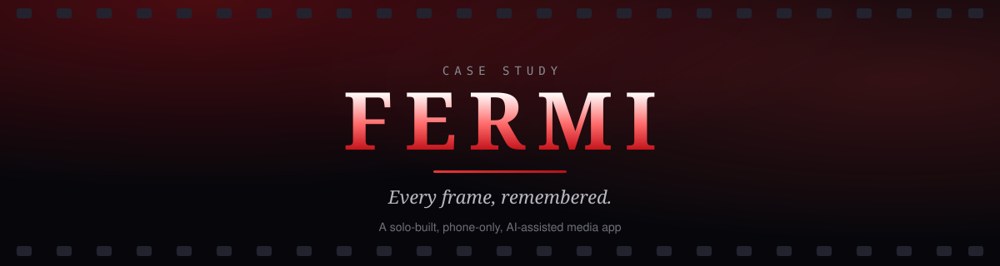
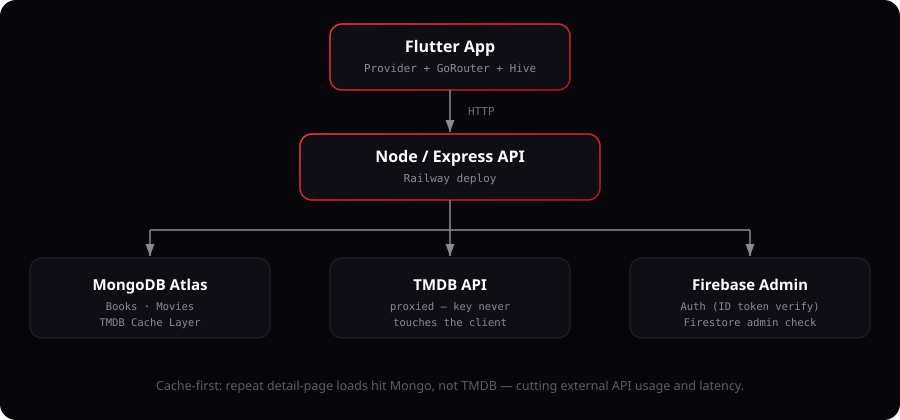

 

 

> ### 🎞️ This isn't a "look at my code" project. It's a **resource-management** project.
> No PC, no professional coding background, a limited budget, and a fixed amount of learning time — and the goal was to squeeze the maximum possible outcome out of exactly those constraints. FERMI is the result: a full production-grade app built by making deliberate, resourceful choices about which tools to use, what to learn, and where to spend effort.

## 📖 Overview

FERMI is a Flutter-based media app that lets users discover movies & TV shows (via TMDB), track what they're watching, manage a personal library, play local downloaded files with smart season/episode grouping, and browse curated free content — all wrapped in a custom dark, cinematic UI.

| 🎬 Screens | 🛠️ Services | 👤 Builder |
|:---:|:---:|:---:|
| **~20** | **25+** | **Solo** |

- **Role:** Solo builder — product, design, frontend, backend, DevOps
- **Stack:** Flutter (Dart) · Node.js/Express · MongoDB Atlas · Firebase Auth/Firestore · TMDB API
- **The real constraint:** built entirely on a budget Android phone, no desktop/laptop, no professional coding background — just deliberate resource management and a fully AI-assisted ("vibe coding") workflow

## 🧩 This Is a Resource-Management Story, Not a Code-Flex

I am **not a professional coder**. FERMI was built during my early learning period, and the actual skill on display here isn't syntax — it's how far a limited set of resources can be stretched when they're used deliberately.

| Constraint | What it meant in practice |
|---|---|
| 📱 **No PC** | The entire build, test, and iteration loop happens on a phone |
| 🎓 **No formal coding background** | Every technical decision made through an AI-assisted ("vibe coding") process, not memorized best practices |
| ⏳ **Limited time, limited budget** | Every tool below was picked for maximum leverage per rupee and per hour — not because it was the "correct" professional setup |

The project itself is proof of the process: knowing what to learn, what to delegate to AI, and what tool to reach for at each stage — and turning that into a shipped, working, multi-service app.

## 🧰 The Toolkit

**This is a fully vibe-coded project** — every line shaped through AI collaboration rather than hand-written from scratch, with my role being direction, decisions, and taste rather than syntax.

| Tool | Role |
|---|---|
| 🤖 **Claude** | Code generation, debugging, architecture decisions — the actual "coding" |
| 🎨 **Gemini** | UI/UX design direction and visual design decisions |
| 📟 **Termux** | On-device file management, git operations, running commands — the phone's terminal |
| 🐙 **GitHub** | Version control and source hosting |
| 🚀 **Codemagic** | CI/CD — compiles and signs the release APK, since the phone itself can't build one |

## 🏗️ Architecture

**Frontend:** Provider for state, `go_router` for declarative navigation + deep linking, Hive for local persistence (library, watch progress, screen cache).

**Backend:** Express server proxies all TMDB calls (API key never touches the client), with a **cache-first layer** — a MongoDB-backed cache keyed on `(tmdbId, mediaType, seasonNum)` so repeat detail-page loads hit Mongo, not TMDB, cutting external API usage and shaving latency.

**Auth:** Firebase Auth (email + Google Sign-In) on the client; the backend independently verifies Firebase ID tokens and cross-checks a Firestore `admins/{email}` collection before allowing any admin-only route — a deliberate two-layer check rather than trusting client-side role claims.

## ⚡ Engineering Highlights

<b>🕐 Boot-time optimization</b>

 
Early versions blocked the intro animation behind auth-session restore + a live Firestore profile fetch — a real network round-trip sitting in front of a purely cosmetic animation. Refactored so the intro plays immediately while auth/profile hydration runs concurrently in the background; screens listening via <code>Provider</code> simply rebuild the moment hydration finishes. No perceived wait, same correctness.

<b>🗂️ Local file intelligence</b>

 
A from-scratch grouping engine (<code>local_grouping_service.dart</code>, <code>local_sequence_parser.dart</code>) parses arbitrary local filenames into structured show/season/episode metadata — handling the wildly inconsistent naming conventions real downloaded media actually has — then cross-references TMDB collections to show placeholder cards for sequels/parts the user hasn't downloaded yet.

<b>🚦 Rate limiting done properly</b>

 
Three independently-tuned limiters (general API, TMDB proxy, contact form) — the general limit was deliberately raised after discovering that a single home-screen load fans out one request per genre row, and a too-tight window caused legitimate next-clicks to get 429'd. A real bug found by real usage, not a code review.

<b>🔗 Deep linking</b>

 
Full <code>AppLinks</code> integration handling both cold-start (app launched from a link) and warm-app scenarios, resolving <code>https://tv.fermi.workers.dev/item/{type}/{tmdbId}</code> and <code>/freemovie/{videoId}</code> URLs into in-app navigation — backed by <code>assetlinks.json</code> for Android App Links auto-verification.

<b>🚢 Shipping discipline</b>

 
Features get built ahead of their backend being ready (AI Chat, Live TV) and shipped <i>disabled</i> behind clearly-commented flags rather than half-working — the codebase documents exactly what's paused and why, so re-enabling for a v2 is a known, scoped task rather than an archaeology project.

## ✨ Feature Surface

- 🔍 Home / Discover (TMDB trending, popular, top-rated)
- 🎬 Movie & TV detail pages (cast, trailers, similar titles, collections)
- 📚 Personal library with watch history & resume/continue-watching
- 📁 Local file playback with automatic show/season grouping
- 🎥 Free Movies (curated, Telegram-bot-reviewed YouTube content)
- 📱 Shorts-style vertical video browsing
- 📺 Cast support
- 🌐 Multi-language UI (Sinhala-first, with an in-app translation layer)
- ⚙️ Profile, settings, and a companion admin app for content management

## 🎯 What This Project Demonstrates

- ✅ **Resourcefulness under real constraints** — no PC, no formal background, limited time/budget, and still a shipped, working, multi-service production app
- ✅ Deliberate tool selection: Claude for code, Gemini for design, Termux for on-device ops, Codemagic to bridge the "no PC" gap
- ✅ Backend thinking that goes beyond CRUD: caching strategy, layered auth, abuse-resistant rate limiting
- ✅ Comfort directing the full stack: Flutter UI, Node/Express API, MongoDB schema design, Firebase integration, CI/CD — even without hand-writing every line
- ✅ Mature shipping habits: documented trade-offs, deliberately-scoped disabled features, bugs traced to root cause and explained in-line

## 📬 Try It / Source Access

| | |
|---|---|
| 🎬 **Live demo / APK** | [Download APK](https://github.com/Podda2006/Fermi-app/releases/download/v1.1.0/Fermi.app-release.apk) |
| 🔒 **Source code** | Kept private |
| ✉️ **Contact** | [Contact Us](https://t.me/Podda_2006_88) |
| ✉️ **Screen** | [View Screen](https://t.me/c/4402259834/6) |

> ⚠️ If the backend isn't live when you try the demo (it's a personal-project server, not guaranteed 24/7 uptime), or if you'd like to see the source — **just reach out via the contact form/message above**. Happy to set up a temporary private repo view or walk through the code directly.

 

<b>FERMI</b> — Every frame, remembered.

